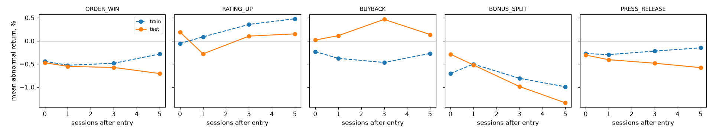

# M3 event study: results

- Run `20261004T061547Z`; config `3b3ec2ca2c67…` (pre-registered: `docs/research/M3_prereg.md`); taxonomy `taxonomy-v1+6f16e1c9`.
- Data: {'eod_rows': 4256401, 'eod_first': datetime.date(2019, 10, 1), 'eod_last': datetime.date(2026, 10, 1)}
- Train: entries ≤ 2023-12-31; **test (holdout): entries ≥ 2024-01-01**, through 2026-09-30.
- Net = market-adjusted return − 0.50% flat round trip (an assumption until M6's verified cost model).

## G1 decision (pre-registered rule, test period only)

**No confirmatory hypothesis passes: no edge found at the daily horizon.** Stop for the human (DESIGN §Backlog lists the next hypotheses).

| Type | Exit | N test | Mean net | 95% CI (bootstrap) | Hit rate | t | p (1-sided) | p (BH) | FCR lower | Verdict |
|---|---|---|---|---|---|---|---|---|---|---|
| ORDER_WIN | d0 | 2447 | -0.97% | [-1.10%, -0.84%] | 0.28 | -14.75 | 1.0000 | 1.0000 | n/a | fail: mean net abnormal return <= 0; not selected by BH at q=0.05 |
| ORDER_WIN | d1 | 2445 | -1.05% | [-1.25%, -0.86%] | 0.31 | -10.51 | 1.0000 | 1.0000 | n/a | fail: mean net abnormal return <= 0; not selected by BH at q=0.05 |
| ORDER_WIN | d3 | 2430 | -1.08% | [-1.34%, -0.80%] | 0.34 | -7.93 | 1.0000 | 1.0000 | n/a | fail: mean net abnormal return <= 0; not selected by BH at q=0.05 |
| ORDER_WIN | d5 | 2420 | -1.21% | [-1.53%, -0.88%] | 0.35 | -7.25 | 1.0000 | 1.0000 | n/a | fail: mean net abnormal return <= 0; not selected by BH at q=0.05 |
| RATING_UP | d0 | 91 | -0.31% | [-0.78%, +0.16%] | 0.41 | -1.28 | 0.8982 | 1.0000 | n/a | fail: N_test 91 < 100; mean net abnormal return <= 0; not selected by BH at q=0.05 |
| RATING_UP | d1 | 91 | -0.78% | [-1.45%, -0.12%] | 0.34 | -2.32 | 0.9885 | 1.0000 | n/a | fail: N_test 91 < 100; mean net abnormal return <= 0; not selected by BH at q=0.05 |
| RATING_UP | d3 | 91 | -0.40% | [-1.33%, +0.54%] | 0.49 | -0.83 | 0.7944 | 1.0000 | n/a | fail: N_test 91 < 100; mean net abnormal return <= 0; not selected by BH at q=0.05 |
| RATING_UP | d5 | 91 | -0.35% | [-1.52%, +0.88%] | 0.42 | -0.56 | 0.7119 | 1.0000 | n/a | fail: N_test 91 < 100; mean net abnormal return <= 0; not selected by BH at q=0.05 |
| BUYBACK | d0 | 195 | -0.48% | [-0.85%, -0.10%] | 0.37 | -2.52 | 0.9936 | 1.0000 | n/a | fail: mean net abnormal return <= 0; not selected by BH at q=0.05 |
| BUYBACK | d1 | 195 | -0.39% | [-0.82%, +0.06%] | 0.45 | -1.70 | 0.9548 | 1.0000 | n/a | fail: mean net abnormal return <= 0; not selected by BH at q=0.05 |
| BUYBACK | d3 | 193 | -0.04% | [-0.72%, +0.68%] | 0.48 | -0.10 | 0.5398 | 1.0000 | n/a | fail: mean net abnormal return <= 0; not selected by BH at q=0.05 |
| BUYBACK | d5 | 192 | -0.36% | [-1.12%, +0.46%] | 0.46 | -0.89 | 0.8137 | 1.0000 | n/a | fail: mean net abnormal return <= 0; not selected by BH at q=0.05 |
| BONUS_SPLIT | d0 | 327 | -0.79% | [-1.20%, -0.36%] | 0.33 | -3.67 | 0.9999 | 1.0000 | n/a | fail: mean net abnormal return <= 0; not selected by BH at q=0.05 |
| BONUS_SPLIT | d1 | 327 | -1.02% | [-1.61%, -0.38%] | 0.33 | -3.28 | 0.9994 | 1.0000 | n/a | fail: mean net abnormal return <= 0; not selected by BH at q=0.05 |
| BONUS_SPLIT | d3 | 325 | -1.49% | [-2.13%, -0.81%] | 0.34 | -4.42 | 1.0000 | 1.0000 | n/a | fail: mean net abnormal return <= 0; not selected by BH at q=0.05 |
| BONUS_SPLIT | d5 | 323 | -1.84% | [-2.64%, -1.02%] | 0.34 | -4.41 | 1.0000 | 1.0000 | n/a | fail: mean net abnormal return <= 0; not selected by BH at q=0.05 |
| PRESS_RELEASE | d0 | 8662 | -0.81% | [-0.89%, -0.72%] | 0.33 | -17.68 | 1.0000 | 1.0000 | n/a | fail: mean net abnormal return <= 0; not selected by BH at q=0.05 |
| PRESS_RELEASE | d1 | 8659 | -0.91% | [-1.03%, -0.78%] | 0.36 | -14.21 | 1.0000 | 1.0000 | n/a | fail: mean net abnormal return <= 0; not selected by BH at q=0.05 |
| PRESS_RELEASE | d3 | 8642 | -0.98% | [-1.16%, -0.81%] | 0.37 | -11.15 | 1.0000 | 1.0000 | n/a | fail: mean net abnormal return <= 0; not selected by BH at q=0.05 |
| PRESS_RELEASE | d5 | 8620 | -1.08% | [-1.28%, -0.88%] | 0.38 | -10.51 | 1.0000 | 1.0000 | n/a | fail: mean net abnormal return <= 0; not selected by BH at q=0.05 |

## All types, train vs test

| Type | Kind | Exit | Train N | Train mean net | Test N | Test mean net | Test median | Test gross |
|---|---|---|---|---|---|---|---|---|
| ORDER_WIN | confirmatory | d0 | 958 | -0.94% | 2447 | -0.97% | -1.12% | -0.47% |
| ORDER_WIN | confirmatory | d1 | 954 | -1.03% | 2445 | -1.05% | -1.39% | -0.55% |
| ORDER_WIN | confirmatory | d3 | 944 | -0.98% | 2430 | -1.08% | -1.61% | -0.58% |
| ORDER_WIN | confirmatory | d5 | 942 | -0.78% | 2420 | -1.21% | -1.78% | -0.71% |
| RATING_UP | confirmatory | d0 | 223 | -0.56% | 91 | -0.31% | -0.46% | +0.19% |
| RATING_UP | confirmatory | d1 | 223 | -0.41% | 91 | -0.78% | -0.78% | -0.28% |
| RATING_UP | confirmatory | d3 | 223 | -0.14% | 91 | -0.40% | -0.09% | +0.10% |
| RATING_UP | confirmatory | d5 | 222 | -0.02% | 91 | -0.35% | -0.77% | +0.15% |
| BUYBACK | confirmatory | d0 | 400 | -0.73% | 195 | -0.48% | -0.60% | +0.02% |
| BUYBACK | confirmatory | d1 | 398 | -0.88% | 195 | -0.39% | -0.26% | +0.11% |
| BUYBACK | confirmatory | d3 | 398 | -0.97% | 193 | -0.04% | -0.15% | +0.46% |
| BUYBACK | confirmatory | d5 | 397 | -0.77% | 192 | -0.36% | -0.66% | +0.14% |
| BONUS_SPLIT | confirmatory | d0 | 251 | -1.20% | 327 | -0.79% | -1.17% | -0.29% |
| BONUS_SPLIT | confirmatory | d1 | 250 | -1.00% | 327 | -1.02% | -1.51% | -0.52% |
| BONUS_SPLIT | confirmatory | d3 | 248 | -1.31% | 325 | -1.49% | -1.58% | -0.99% |
| BONUS_SPLIT | confirmatory | d5 | 247 | -1.49% | 323 | -1.84% | -2.12% | -1.34% |
| PRESS_RELEASE | confirmatory | d0 | 8114 | -0.77% | 8662 | -0.81% | -0.99% | -0.31% |
| PRESS_RELEASE | confirmatory | d1 | 8082 | -0.80% | 8659 | -0.91% | -1.15% | -0.41% |
| PRESS_RELEASE | confirmatory | d3 | 8041 | -0.72% | 8642 | -0.98% | -1.34% | -0.48% |
| PRESS_RELEASE | confirmatory | d5 | 8063 | -0.65% | 8620 | -1.08% | -1.52% | -0.58% |
| RESULTS | exploratory | d0 | 4415 | -1.06% | 10417 | -1.09% | -1.38% | -0.59% |
| RESULTS | exploratory | d1 | 4400 | -1.11% | 10410 | -1.25% | -1.66% | -0.75% |
| RESULTS | exploratory | d3 | 4391 | -1.13% | 10401 | -1.40% | -2.00% | -0.90% |
| RESULTS | exploratory | d5 | 4387 | -1.14% | 10386 | -1.56% | -2.23% | -1.06% |
| DIVIDEND | exploratory | d0 | 4833 | -0.85% | 5600 | -0.79% | -1.00% | -0.29% |
| DIVIDEND | exploratory | d1 | 4824 | -0.75% | 5596 | -0.72% | -1.04% | -0.22% |
| DIVIDEND | exploratory | d3 | 4810 | -0.48% | 5589 | -0.72% | -1.16% | -0.22% |
| DIVIDEND | exploratory | d5 | 4813 | -0.41% | 5581 | -0.75% | -1.39% | -0.25% |
| ACQUISITION | exploratory | d0 | 5301 | -0.77% | 7159 | -0.64% | -0.80% | -0.14% |
| ACQUISITION | exploratory | d1 | 5271 | -0.77% | 7156 | -0.60% | -0.86% | -0.10% |
| ACQUISITION | exploratory | d3 | 5217 | -0.74% | 7115 | -0.48% | -0.94% | +0.02% |
| ACQUISITION | exploratory | d5 | 5238 | -0.69% | 7071 | -0.48% | -0.93% | +0.02% |
| FUNDRAISE | exploratory | d0 | 2075 | -0.67% | 2165 | -0.79% | -0.95% | -0.29% |
| FUNDRAISE | exploratory | d1 | 2073 | -0.77% | 2163 | -0.69% | -1.02% | -0.19% |
| FUNDRAISE | exploratory | d3 | 2061 | -0.69% | 2148 | -0.49% | -1.04% | +0.01% |
| FUNDRAISE | exploratory | d5 | 2058 | -0.56% | 2133 | -0.60% | -1.12% | -0.10% |
| PLEDGE_CHANGE | exploratory | d0 | 115 | -0.49% | 72 | -0.57% | -0.70% | -0.07% |
| PLEDGE_CHANGE | exploratory | d1 | 115 | -0.49% | 72 | -1.09% | -1.43% | -0.59% |
| PLEDGE_CHANGE | exploratory | d3 | 115 | -1.25% | 72 | -0.45% | -1.33% | +0.05% |
| PLEDGE_CHANGE | exploratory | d5 | 115 | -1.59% | 71 | -0.43% | -1.09% | +0.07% |
| BUSINESS_UPDATE | exploratory | d0 | 5462 | -0.62% | 7864 | -0.65% | -0.87% | -0.15% |
| BUSINESS_UPDATE | exploratory | d1 | 5436 | -0.54% | 7860 | -0.61% | -0.88% | -0.11% |
| BUSINESS_UPDATE | exploratory | d3 | 5393 | -0.44% | 7826 | -0.61% | -1.02% | -0.11% |
| BUSINESS_UPDATE | exploratory | d5 | 5418 | -0.34% | 7787 | -0.65% | -1.12% | -0.15% |
| MGMT_CHANGE | exploratory | d0 | 9822 | -0.75% | 16057 | -0.74% | -0.88% | -0.24% |
| MGMT_CHANGE | exploratory | d1 | 9789 | -0.71% | 16049 | -0.73% | -0.97% | -0.23% |
| MGMT_CHANGE | exploratory | d3 | 9728 | -0.61% | 15985 | -0.70% | -1.11% | -0.20% |
| MGMT_CHANGE | exploratory | d5 | 9739 | -0.53% | 15908 | -0.72% | -1.25% | -0.22% |
| RATING_DOWN | exploratory | d0 | 53 | -0.05% | 8 | -1.11% | -1.02% | -0.61% |
| RATING_DOWN | exploratory | d1 | 53 | +0.58% | 8 | +0.25% | -2.02% | +0.75% |
| RATING_DOWN | exploratory | d3 | 53 | +0.18% | 8 | +0.21% | -2.28% | +0.71% |
| RATING_DOWN | exploratory | d5 | 53 | -0.16% | 8 | +1.12% | -0.59% | +1.62% |
| PENALTY_LITIGATION | exploratory | d0 | 1555 | -0.76% | 5802 | -0.58% | -0.72% | -0.08% |
| PENALTY_LITIGATION | exploratory | d1 | 1552 | -0.77% | 5792 | -0.54% | -0.75% | -0.04% |
| PENALTY_LITIGATION | exploratory | d3 | 1544 | -0.82% | 5749 | -0.50% | -0.83% | -0.00% |
| PENALTY_LITIGATION | exploratory | d5 | 1539 | -0.66% | 5712 | -0.57% | -0.94% | -0.07% |
| INSOLVENCY | exploratory | d0 | 111 | -0.63% | 104 | -0.38% | -0.60% | +0.12% |
| INSOLVENCY | exploratory | d1 | 109 | -0.93% | 104 | -0.51% | -0.52% | -0.01% |
| INSOLVENCY | exploratory | d3 | 109 | -1.13% | 101 | -0.64% | -0.68% | -0.14% |
| INSOLVENCY | exploratory | d5 | 108 | -1.27% | 101 | -0.31% | -0.65% | +0.19% |
| HOLDING_CHANGE | exploratory | d0 | 5110 | -0.56% | 5832 | -0.54% | -0.78% | -0.04% |
| HOLDING_CHANGE | exploratory | d1 | 5104 | -0.41% | 5829 | -0.45% | -0.79% | +0.05% |
| HOLDING_CHANGE | exploratory | d3 | 5097 | -0.16% | 5817 | -0.36% | -0.85% | +0.14% |
| HOLDING_CHANGE | exploratory | d5 | 5093 | +0.27% | 5792 | -0.08% | -0.75% | +0.42% |
| BOARD_OUTCOME | exploratory | d0 | 9020 | -1.14% | 9398 | -1.07% | -1.31% | -0.57% |
| BOARD_OUTCOME | exploratory | d1 | 8983 | -1.28% | 9385 | -1.16% | -1.50% | -0.66% |
| BOARD_OUTCOME | exploratory | d3 | 8914 | -1.22% | 9343 | -1.23% | -1.74% | -0.73% |
| BOARD_OUTCOME | exploratory | d5 | 8933 | -1.27% | 9313 | -1.27% | -2.00% | -0.77% |

## Mean abnormal return by horizon

## By liquidity (exploratory; test period, net)

| Type | Median traded value | Exit | N | Mean net |
|---|---|---|---|---|
| ORDER_WIN | Rs 1-10 Cr | d0 | 731 | -1.02% |
| ORDER_WIN | Rs 1-10 Cr | d1 | 730 | -1.22% |
| ORDER_WIN | Rs 1-10 Cr | d3 | 726 | -1.17% |
| ORDER_WIN | Rs 1-10 Cr | d5 | 723 | -1.24% |
| ORDER_WIN | Rs 10-100 Cr | d0 | 1188 | -1.04% |
| ORDER_WIN | Rs 10-100 Cr | d1 | 1187 | -1.09% |
| ORDER_WIN | Rs 10-100 Cr | d3 | 1178 | -1.16% |
| ORDER_WIN | Rs 10-100 Cr | d5 | 1172 | -1.40% |
| ORDER_WIN | >= Rs 100 Cr | d0 | 528 | -0.75% |
| ORDER_WIN | >= Rs 100 Cr | d1 | 528 | -0.74% |
| ORDER_WIN | >= Rs 100 Cr | d3 | 526 | -0.75% |
| ORDER_WIN | >= Rs 100 Cr | d5 | 525 | -0.74% |
| RATING_UP | Rs 1-10 Cr | d0 | 17 | -1.07% |
| RATING_UP | Rs 1-10 Cr | d1 | 17 | -2.63% |
| RATING_UP | Rs 1-10 Cr | d3 | 17 | -1.09% |
| RATING_UP | Rs 1-10 Cr | d5 | 17 | -1.13% |
| RATING_UP | Rs 10-100 Cr | d0 | 45 | -0.74% |
| RATING_UP | Rs 10-100 Cr | d1 | 45 | -0.81% |
| RATING_UP | Rs 10-100 Cr | d3 | 45 | -0.71% |
| RATING_UP | Rs 10-100 Cr | d5 | 45 | -0.91% |
| RATING_UP | >= Rs 100 Cr | d0 | 29 | +0.80% |
| RATING_UP | >= Rs 100 Cr | d1 | 29 | +0.34% |
| RATING_UP | >= Rs 100 Cr | d3 | 29 | +0.50% |
| RATING_UP | >= Rs 100 Cr | d5 | 29 | +0.98% |
| BUYBACK | Rs 1-10 Cr | d0 | 91 | -0.75% |
| BUYBACK | Rs 1-10 Cr | d1 | 91 | -0.71% |
| BUYBACK | Rs 1-10 Cr | d3 | 89 | -0.28% |
| BUYBACK | Rs 1-10 Cr | d5 | 88 | -0.48% |
| BUYBACK | Rs 10-100 Cr | d0 | 68 | +0.01% |
| BUYBACK | Rs 10-100 Cr | d1 | 68 | +0.07% |
| BUYBACK | Rs 10-100 Cr | d3 | 68 | +0.15% |
| BUYBACK | Rs 10-100 Cr | d5 | 68 | -0.35% |
| BUYBACK | >= Rs 100 Cr | d0 | 36 | -0.72% |
| BUYBACK | >= Rs 100 Cr | d1 | 36 | -0.44% |
| BUYBACK | >= Rs 100 Cr | d3 | 36 | +0.22% |
| BUYBACK | >= Rs 100 Cr | d5 | 36 | -0.13% |
| BONUS_SPLIT | Rs 1-10 Cr | d0 | 140 | -0.76% |
| BONUS_SPLIT | Rs 1-10 Cr | d1 | 140 | -0.72% |
| BONUS_SPLIT | Rs 1-10 Cr | d3 | 138 | -1.51% |
| BONUS_SPLIT | Rs 1-10 Cr | d5 | 137 | -1.75% |
| BONUS_SPLIT | Rs 10-100 Cr | d0 | 125 | -0.99% |
| BONUS_SPLIT | Rs 10-100 Cr | d1 | 125 | -1.51% |
| BONUS_SPLIT | Rs 10-100 Cr | d3 | 125 | -1.54% |
| BONUS_SPLIT | Rs 10-100 Cr | d5 | 125 | -2.22% |
| BONUS_SPLIT | >= Rs 100 Cr | d0 | 62 | -0.45% |
| BONUS_SPLIT | >= Rs 100 Cr | d1 | 62 | -0.71% |
| BONUS_SPLIT | >= Rs 100 Cr | d3 | 62 | -1.32% |
| BONUS_SPLIT | >= Rs 100 Cr | d5 | 61 | -1.25% |
| PRESS_RELEASE | Rs 1-10 Cr | d0 | 2775 | -0.92% |
| PRESS_RELEASE | Rs 1-10 Cr | d1 | 2773 | -1.08% |
| PRESS_RELEASE | Rs 1-10 Cr | d3 | 2767 | -1.30% |
| PRESS_RELEASE | Rs 1-10 Cr | d5 | 2763 | -1.42% |
| PRESS_RELEASE | Rs 10-100 Cr | d0 | 3754 | -0.77% |
| PRESS_RELEASE | Rs 10-100 Cr | d1 | 3753 | -0.86% |
| PRESS_RELEASE | Rs 10-100 Cr | d3 | 3745 | -0.98% |
| PRESS_RELEASE | Rs 10-100 Cr | d5 | 3732 | -1.09% |
| PRESS_RELEASE | >= Rs 100 Cr | d0 | 2133 | -0.73% |
| PRESS_RELEASE | >= Rs 100 Cr | d1 | 2133 | -0.76% |
| PRESS_RELEASE | >= Rs 100 Cr | d3 | 2130 | -0.58% |
| PRESS_RELEASE | >= Rs 100 Cr | d5 | 2125 | -0.61% |

## Where every filing went

| Type | kept | excluded_category | outside_window | unlinked | no_nse_listing | no_entry_price | low_price | illiquid | locked_entry | circuit_gap | review_action | duplicate |
|---|---|---|---|---|---|---|---|---|---|---|---|---|
| ORDER_WIN | 3410 | 0 | 12 | 0 | 1 | 593 | 75 | 817 | 22 | 2 | 6 | 1316 |
| RATING_UP | 314 | 0 | 0 | 0 | 0 | 17 | 6 | 65 | 0 | 0 | 0 | 18 |
| BUYBACK | 595 | 351 | 2 | 0 | 0 | 48 | 0 | 203 | 1 | 0 | 0 | 416 |
| BONUS_SPLIT | 579 | 0 | 0 | 0 | 0 | 334 | 10 | 190 | 8 | 1 | 0 | 182 |
| PRESS_RELEASE | 16798 | 0 | 14 | 0 | 3 | 1078 | 234 | 2636 | 73 | 14 | 10 | 4198 |
| RESULTS | 14832 | 0 | 2 | 0 | 10 | 3997 | 1007 | 7530 | 90 | 11 | 4 | 4451 |
| DIVIDEND | 10441 | 0 | 0 | 0 | 0 | 875 | 60 | 3673 | 43 | 9 | 5 | 5478 |
| ACQUISITION | 12478 | 0 | 29 | 0 | 14 | 1346 | 264 | 2409 | 43 | 5 | 27 | 4133 |
| FUNDRAISE | 4246 | 0 | 8 | 0 | 4 | 1235 | 363 | 1418 | 27 | 1 | 144 | 1485 |
| PLEDGE_CHANGE | 187 | 0 | 0 | 0 | 0 | 65 | 27 | 97 | 1 | 0 | 0 | 27 |
| BUSINESS_UPDATE | 13354 | 0 | 25 | 0 | 3 | 1245 | 255 | 2451 | 40 | 3 | 7 | 3512 |
| MGMT_CHANGE | 25894 | 0 | 177 | 0 | 19 | 9237 | 2229 | 12968 | 121 | 14 | 34 | 14710 |
| RATING_DOWN | 61 | 0 | 0 | 0 | 0 | 11 | 4 | 29 | 2 | 0 | 0 | 3 |
| PENALTY_LITIGATION | 7364 | 0 | 18 | 0 | 9 | 2825 | 1017 | 2214 | 25 | 4 | 3 | 2328 |
| INSOLVENCY | 215 | 0 | 8 | 12 | 1 | 4564 | 282 | 139 | 19 | 0 | 0 | 33 |
| HOLDING_CHANGE | 10959 | 0 | 15 | 0 | 53 | 4444 | 1170 | 8197 | 34 | 1 | 19 | 6258 |
| BOARD_OUTCOME | 18423 | 0 | 15 | 1 | 16 | 9120 | 2094 | 11574 | 143 | 17 | 16 | 1902 |

## Spot check (verify by hand against the raw bhavcopy)

| Announcement | Type | Symbol | Entry date | Entry open | d1 return | d1 index | d1 net |
|---|---|---|---|---|---|---|---|
| 1028 | PRESS_RELEASE | RPGLIFE | 2026-09-03 | 2596.9 | +4.80% | -0.20% | +4.50% |
| 768425 | ORDER_WIN | GENUSPOWER | 2024-08-21 | 437.75 | +0.97% | +0.67% | -0.20% |
| 938594 | PRESS_RELEASE | PURVA | 2025-08-11 | 262.75 | -0.61% | +0.54% | -1.65% |
